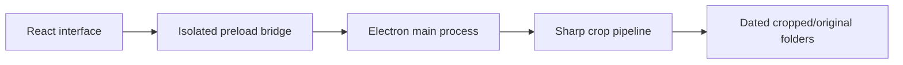

# RPUK Screenshot Cropper

<p align="center">
  <a href="https://github.com/KeyErrorFinn/rpuk-screenshot-cropper/commits/main"></a>
  <a href="https://github.com/KeyErrorFinn/rpuk-screenshot-cropper/issues"></a>
</p>

<p align="center">
  
  
  
  
  
  
  
</p>

A desktop Electron application for reviewing screenshots, removing the fixed FiveM/RPUK interface bands, and organising processed images into date-based folders.

## Features

- Select a source screenshot folder and destination folder.
- Preview PNG, JPEG, and WebP screenshots.
- Select screenshots for batch processing.
- Crop a fixed 36-pixel top band and 53-pixel bottom band with Sharp.
- Group cropped and optional original images by the screenshot modification date.
- Browse processed images from the View tab.
- Persist folder and processing settings locally with `electron-store`.

## How it works

The Electron main process in `src/main/index.js` owns filesystem access and image processing. A context-isolated preload bridge exposes specific operations to the React renderer. The renderer displays lightweight WebP thumbnails, manages selection and settings, and asks the main process to crop files.

Processed files are written below the chosen destination:

```text
destination/
├── cropped/DD-MM-YY/cropped_<original-name>
└── original/DD-MM-YY/<original-name>
```

After successful processing, the source screenshot is deleted. Enable the keep-original setting if you want a copy retained in the destination.

## Development

Requires Node.js/npm and the native dependencies supported by Sharp and Electron.

```bash
npm install
npm run dev
```

Other useful commands:

```bash
npm run lint
npm run build
npm run build:win
npm run build:mac
npm run build:linux
```

## Project structure

- `src/main/`  -  Electron lifecycle, IPC, filesystem operations, and Sharp cropping.
- `src/preload/`  -  isolated renderer API.
- `src/renderer/`  -  React interface, settings, crop, and viewer tabs.
- `electron-builder.yml`  -  packaging configuration.
- `resources/` and `build/`  -  application icons and packaging assets.

## Important notes

- Back up valuable screenshots before first use because processed source files are removed.
- The crop dimensions are tailored to a specific screenshot layout.
- Packaging targets should be tested on their respective operating systems.

## Project flow


