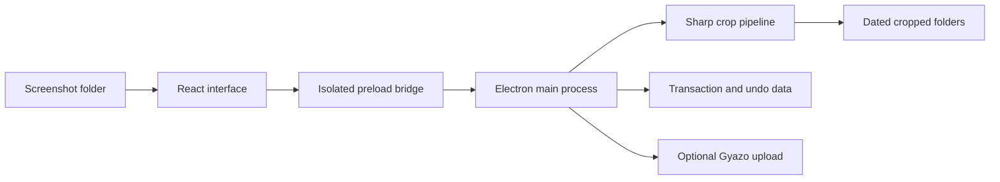

# RPUK Screenshot Cropper

<p align="center">
  <a href="https://github.com/KeyErrorFinn/rpuk-screenshot-cropper/actions/workflows/ci.yml"></a>
  <a href="https://github.com/KeyErrorFinn/rpuk-screenshot-cropper/blob/main/package.json"></a>
  <a href="https://github.com/KeyErrorFinn/rpuk-screenshot-cropper/commits/main"></a>
  <a href="https://github.com/KeyErrorFinn/rpuk-screenshot-cropper/issues"></a>
</p>

<p align="center">
  
  
  
  
  
  
  
</p>

A local Electron desktop utility for cropping repeated interface areas from game screenshots, organising the results by date, and optionally sharing selected images through Gyazo.

## Main workflows

- Watch a configured screenshot folder and load PNG, JPEG, and WebP images.
- Select individual screenshots or crop an entire incoming batch.
- Maintain resolution-aware crop presets for all four image edges.
- Preview removed areas and use local edge suggestions as a starting point.
- Preserve originals when configured and recover interrupted crop operations.
- Review cropped images in dated folders with search, tags, filters, favourites, zoom, and fullscreen viewing.
- Copy images or Gyazo links, upload selected images with retry and resume handling, and move unwanted images to the Recycle Bin.
- Import external files by drag and drop or paste an image from the clipboard.
- Track crop and upload activity, including the files that need attention after a failure.

All image processing and crop assistance happen locally. Images leave the computer only when the user explicitly uploads them to Gyazo.

## How it works

The React renderer talks to Electron through a narrow, context-isolated preload bridge. The Electron main process owns filesystem access, image metadata, crop transactions, recovery, uploads, and clipboard operations. Sharp performs the image transformations, while cached metadata and lightweight WebP thumbnails keep large folders responsive.



Crop batches are staged before the source files are removed. Backups and batch metadata are retained in Electron's application-data directory so interrupted work can be recovered, and undo will not overwrite a newer file at the original source path.

## Development

Requirements: a current Node.js release supported by the installed Electron toolchain and npm.

```powershell
npm.cmd install
npm.cmd run dev
```

Electron main-process and preload changes require a full application restart; renderer hot reload does not reload IPC handlers.

Useful commands:

```powershell
npm.cmd test
npm.cmd run test:ui
npm.cmd run format:check
npm.cmd run lint
npm.cmd run build
npm.cmd run test:e2e
```

Packaging commands are available for Windows, macOS, and Linux:

```powershell
npm.cmd run build:win
npm.cmd run build:mac
npm.cmd run build:linux
```

## Validation

The Node test suite covers services, crop settings, crop assistance, transactions, recovery, uploads, and pure application logic. Vitest covers renderer controllers, dialogs, workspace preferences, and gallery behaviour. Playwright builds an unpacked production executable and exercises the sandbox bridge, filesystem watcher, crop transaction, collision handling, and undo workflow.

The GitHub Actions workflow checks formatting, runs the complete test and lint suites, builds the Electron application, and exercises the packaged app on Windows. This matches the application's primary supported platform and its Recycle Bin-oriented workflows. The CI badge above shows the current result without embedding test counts that can become stale.

## Data and recovery

Settings, image identities, crop history, upload state, diagnostic logs, and thumbnail-cache data are stored under Electron's per-user application-data directory. Crop operations create transaction and undo data there so interrupted batches can be recovered before normal startup.

Deleting a cropped image uses the operating system's Recycle Bin. Undoing a crop restores backed-up source images only when doing so will not overwrite a newer file.

## Keyboard and viewer controls

- `Left` / `Right`: previous or next image.
- Mouse wheel: previous or next image in the normal viewer.
- `Space`: select the displayed image.
- `Ctrl+C`: copy the displayed image.
- `Escape`: close the viewer.
- `Ctrl` + mouse wheel: zoom in the crop editor.
- `Ctrl+Z`, `Ctrl+Y`, `Ctrl+Shift+Z`: crop-editor undo and redo.

## Project structure

- `src/main/`, Electron lifecycle, IPC, filesystem operations, transactions, uploads, and Sharp processing.
- `src/preload/`, the isolated renderer API.
- `src/renderer/`, React screens, crop controls, settings, activity, and gallery viewers.
- `src/shared/`, IPC channels and runtime contracts.
- `tests/`, Node and Vitest unit and integration tests.
- `tests/e2e/`, packaged Playwright coverage.
- `electron-builder.yml`, packaging configuration.
- `resources/` and `build/`, application icons and packaging assets.

## Supported platforms

The application is primarily designed and tested for Windows because it uses Windows taskbar and Recycle Bin-oriented workflows. Packaging configuration also contains macOS and Linux targets, but those platforms should not be described as fully supported until packaged smoke tests are run on them.

## Contributing

Focused fixes are welcome. Before changing behaviour, open an issue describing the problem and intended result. Keep credentials, generated secrets, personal data, and machine-specific configuration out of commits. Run the validation commands above and update this README whenever commands, configuration, paths, or supported behaviour change.

## Licence

No project-level licence is currently declared in this repository. Copyright remains with the repository owner and other contributors; obtain permission before redistributing or incorporating the code elsewhere. Third-party assets and dependencies retain their own licences.
